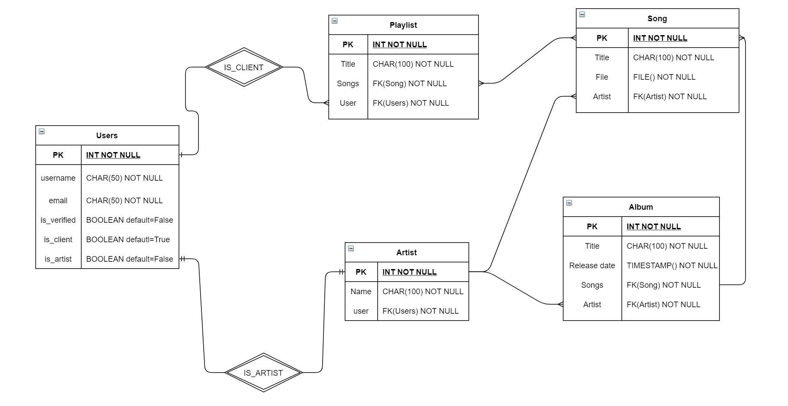

# Django-Music

## Overview:

Django-Music needs a system that allows professional or amateur musicians to upload songs, albums etc, so that anyone from anywhere in the world can listen to them through their portal. they need an API that allows you to do the following:

* Upload the artists' music
* Get the content of the artist in version web and version mobile
* Handle different types of users \(artists, customers\)

### Scope

Creation of a backend infrastructure based on cloud computing and the creation of an API that includes the different endpoints in order to comply with the use cases.

#### Use cases

* As an artist I would like to upload songs, albums etc.
* As a user I would like to be able to follow an artist
* As a user I would like to be able to create a playlist
* As an artist I would like to create a playlist of my music
* As a user I like to be able to follow other users' playlists
* As an artist I would like to be able to erase a song
* As an artist i would like to be able to edit a album

#### Out of Scope \(Unsupported use cases\)

* As a normal user I would like to be able to upload my music
* As an unregistered user I would like to be able to create a playlist
* as an unregistered user I would like to be able to follow an artist
* As an artist I would like to know how many people have listened to me in the last month
* As an artist i would like to be able to edit a song

## Architecture

### Architecture Diagrams

poner diagramas de secuencia, uml, etc

### Data Base design

## Limitations

Lista de limitaciones conocidas. Puede ser en formato de lista. Ej.

* API calls that allow to upload albums, songs or create a playlist do not exceed the latency limits of 500ms
* API calls that allow to get the albums, songs, artists, and playlist do not exceed the latency limits of 200ms

## Cost

Description / Cost Analysis Example: "Considering N daily users, M calls to X service / database / etc"

* 1000 daily calls to serverless functions. $ XX.XX
* 1000 daily read / write units to X Database on-demand. $ XX.XX

  Total: $ xx.xx \(per month / day / year\)

